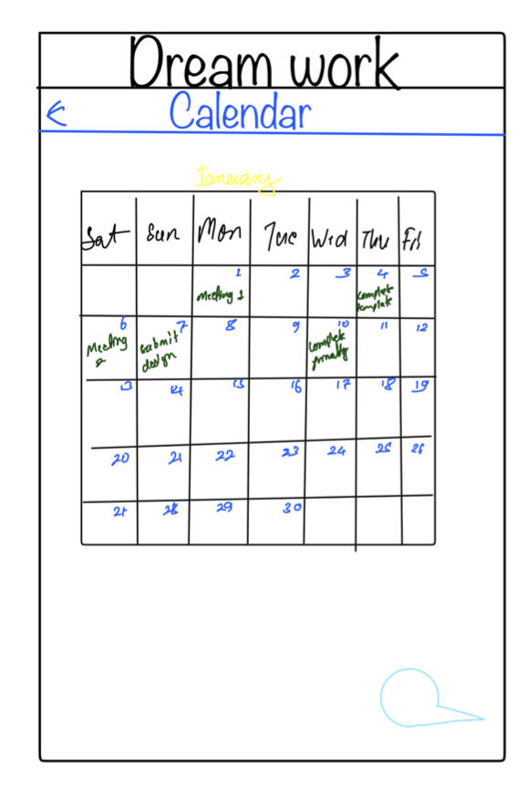
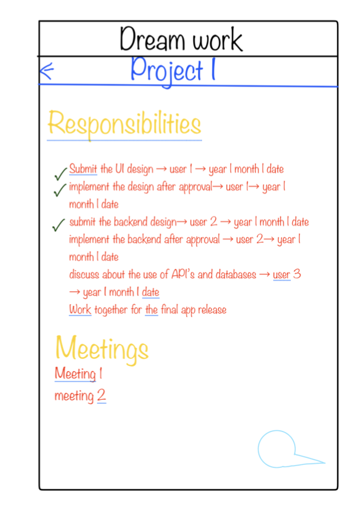

# Proposed
This app will be based on the team up app as presented with additional features like calender, to-do and more. In this app, there will be an account for each individual and each individual will be able to join the group.
Each group will have their goal, to-dos, responsibilities for each members and the due dates. And the specific responsibilities for an individual will be also displayed on the calender of that individual.
The to-dos will have checklist feature where all the completed tasks will be marked checked which will allow the members of projects to have the track of the project progress.
After we built the basic features of the app, we also have plans to add additional features enable chatting between individuals.

# Feature List
|Feature|Priority (1-5)|Effort (1-5)|
|-----|-----|----|
| Design a REST API for query and save data. | 1| 1|
| Design data model for back-end database. | 2| 1|
| Implement data model for back-end database. | 3| 3|
| Implement a REST API | 3| 5|
| Design data model for in-app database.| 2| 1|
| Implement data model for in-app database.| 3| 3|
| Design functions for fetch/send data| 2| 2| 
| Implement functions for fetch/send data| 3| 4| 
| Design a unified user interface| 2| 2|
| Design reusable UI component| 2| 2|
| Chose ready-use library| 2| 2|
| Implement reusable UI component| 3| 4|
| Implement reusable other UI component| 4| 5|
| Document | 4| 2|

# General Timeline
|Date|Activity|
|----|--------|
|March 14| Repository check-in|
|March 16| Design REST API, data model for database|
|March 18| Design the user interface|
|March 20| Design the reusable UI component|
|March 22| Do research on libraries, avoid reinventing the wheel|
|March 24| Implement the back-end|
|March 27| Implement fetch/send functions|
|March 29| Implement reusable UI component|
|March 5| Implement entire user interface|
|March 13| Organize documents|
|April 14| Project due|

# Front End
- **Database**: ```SQLite``` to manage in-app data.
- **Library**: 
  - ...

# Back End
- **Framework**: ```express.js``` - Lightweight Web Framework
- **Database**: ```redis``` - Key-value Database
- **Library**: 
  - ```redis-om``` - a Redis Client Libraries
  - ...

# Mock-Ups




